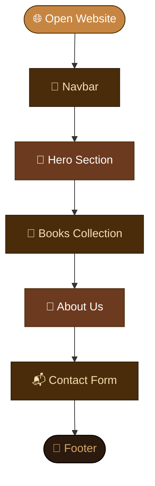

# 📚 The Cozy Bookshop

> A warm and cozy bookshop website built using HTML & CSS.


---

## ✨ Features

- 🧭 Navigation Bar
- 🌅 Hero Section with gradient background
- 📖 Books Collection Grid
- 🏡 About Section
- 📬 Contact Form
- 🦶 Footer

---

## 📁 Folder Structure
```
📁 bookshop/
   ├── 📄 index.html
   └── 🎨 style.css
```

---

## 🔄 Page Flow


---

## 🖥️ Preview

| Section | Description |
|---------|-------------|
| 🧭 Navbar | Logo + navigation links |
| 🌅 Hero | Full page gradient background with CTA button |
| 📖 Books | 4 genre cards — Fiction, Fantasy, Romance, Mystery |
| 🏡 About | Shop story and description |
| 📬 Contact | Name, Email, Message form |
| 🦶 Footer | Copyright info |

---

## ▶️ How to Run
```bash
1. Clone or download the project
2. Open index.html in any browser
3. Grab a coffee ☕ and enjoy!
```

---

## 👨‍💻 Built With

- HTML5 — structure
- CSS3 — styling and layout

---

> *Read More, Live More* 📚
